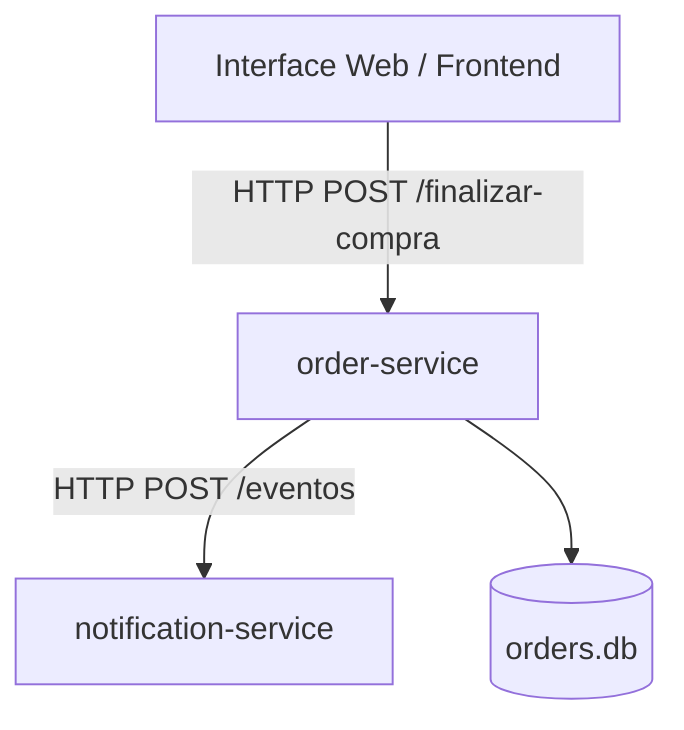

# Catapimbas Shop - Sistema de Checkout de Eletrônicos com Notificações Distribuídas

Este repositório contém o projeto **Catapimbas Shop**, uma solução de software desenvolvida em **Python** como evolução direta do script original `ecommerce_padroes.py` a fim de demonstrar na prática a aplicação de conceitos como: **Clean Code, SOLID, Design Patterns, TDD, BDD, Arquitetura Limpa, Microsserviços, Docker e Deploy**.

---

## 1. Descrição do Problema Escolhido

Em e-commerces de alto valor (como lojas de eletrônicos), o processo de checkout envolve múltiplos sistemas: verificação de estoque, integração de pagamentos, cálculo de fretes e envio de avisos de atualização ao cliente, algumas lojas menores frequentemente perdem vendas ou irritam clientes pela lentidão ou falta de rastreio em tempo real.

**A Solução Catapimbas Shop:**
Uma plataforma baseada em microsserviços onde a criação de pedidos e cálculo de frete são isolados do sistema de comunicação com o cliente. O checkout é simplificado através de um painel web que dispara, de forma instantânea e assíncrona, notificações de confirmação de email (via SMTP) de acordo com o status atualizado do pedido.

---

## 2. Divisão da Solução em Microsserviços

O sistema foi modularizado em dois microsserviços independentes e um painel web frontend de checkout:



* **`order_service` (Porta 3001)**: Gerencia o ciclo de vida dos pedidos, as regras de checkout e a persistência em banco de dados local. Ele atua como publicador no padrão Observer, disparando webhooks de alteração de status.
* **`notification_service` (Porta 3002)**: Recebe os webhooks e processa as notificações escolhendo as estratégias de envio e centraliza logs por meio de um serviço único.
* **`frontend` (Interface de Usuário)**: Painel SPA localizado na pasta `frontend/index.html` que serve como interface do cliente e terminal de visualização de logs.

---

## 3. Organização do Projeto utilizando Arquitetura Limpa

A estrutura do projeto está organizada em subdiretórios específicos para cada contexto:

```
├── order_service/
│   ├── app.py                # Contém:
│   │                         #  - Domínio (Entities: Pedido)
│   │                         #  - Casos de Uso (Checkout, ListOrders, UpdateStatus)
│   │                         #  - Adaptadores (RepositorioPedidoSql, ObservadorPedidoHttp)
│   │                         #  - Infraestrutura (Servidor Flask e endpoints API)
│   ├── app_test.py           # Testes unitários (TDD) e integração (BDD)
│   ├── Dockerfile
│   └── requirements.txt
├── notification_service/
│   ├── app.py                # Contém:
│   │                         #  - Interfaces de Estratégia
│   │                         #  - Adaptadores SMTP (E-mail real)
│   │                         #  - Infraestrutura (Flask server e logs)
│   ├── app_test.py           # Testes unitários e de API
│   ├── Dockerfile
│   └── requirements.txt
├── frontend/
│   ├── index.html            # Estrutura HTML do painel web
│   ├── index.css             # Estilos CSS desacoplados (Separação de Conceitos)
├── docker-compose.yml        # Orquestrador local
├── render.yaml               # Blueprint de deploy em nuvem (Render)
├── run-tests.ps1             # Script para rodar todos os testes no Docker
└── .env                      # Credenciais reais de SMTP
```

---

## 4. Aplicação dos Princípios SOLID

* **S - Single Responsibility Principle (Princípio da Responsabilidade Única)**:
  Cada módulo ou classe resolve um único problema. A entidade `Pedido` gerencia apenas dados e observadores do pedido. A `FachadaCheckout` isola a complexidade de subsistemas externos e a fábrica cuida apenas da instanciação de estratégias de entrega.
* **O - Open/Closed Principle (Princípio Aberto/Fechado)**:
  A `FabricaEstrategiaNotificacao` e a `FabricaEntrega` permitem a extensão e criação de novos canais de envio (ex: WhatsApp) ou novos meios de transporte sem modificar a lógica principal dos controladores ou fachadas.
* **L - Liskov Substitution Principle (Princípio da Substituição de Liskov)**:
  As classes de entrega (`EntregaCorreios`, `EntregaTransportadora`, `RetiradaLoja`) substituem a classe base abstrata `EntregaBase` sem alterar o comportamento esperado no cálculo do checkout.
* **I - Interface Segregation Principle (Princípio da Segregação de Interface)**:
  Definição de interfaces enxutas e focadas no domínio via classes abstratas nativas do Python (`abc.ABC`).
* **D - Dependency Inversion Principle (Princípio da Inversão de Dependência)**:
  O `Pedido` e a `FachadaCheckout` dependem apenas de abstrações das interfaces (`ObservadorPedido`, `EntregaBase`). As implementações concretas (como `ObservadorPedidoHttp` e repositórios) são fornecidas/injetadas de fora.

---

## 5. Aplicação dos Design Patterns

Adaptei os **4 padrões de projeto** do script original para a arquitetura distribuída:

1. **Facade (Padrão de Projeto Estrutural)**:
   * *Onde*: `FachadaCheckout`.
   * *Função*: Simplifica a interface complexa de múltiplos subsistemas (estoque, pagamento, cálculo de frete) em um único método `realizar_checkout`.
2. **Factory Method (Padrão de Projeto Criacional)**:
   * *Onde*: `FabricaEntrega` e subclasses de `EntregaBase`.
   * *Função*: Desacopla a criação das estratégias de entrega do código do checkout, instanciando-as dinamicamente pelo tipo de frete informado.
3. **Observer (Padrão de Projeto Comportamental)**:
   * *Onde*: `Pedido`, `ObservadorPedido` e `ObservadorPedidoHttp`.
   * *Função*: Modifiquei o Observer original de memória para um formato distribuído. O `ObservadorPedidoHttp` é registrado no pedido e envia um webhook HTTP POST para o `notification-service` quando o status muda.
4. **Singleton (Padrão de Projeto Criacional)**:
   * *Onde*: `GerenciadorLog` no `notification-service`.
   * *Função*: Garante que haja apenas uma instância na memória gravando e exibindo o histórico unificado de logs de notificações disparadas.

---

## 6. Envio de email

Diferente de implementações mockadas comuns, o Catapimbas Shop realiza disparos **REAIS** de notificações:

* **E-mail Real (SMTP)**:
  Implementado usando os pacotes nativos do Python `smtplib` e `email.mime`. Ele se conecta de forma segura via TLS a qualquer servidor de email (como o Gmail usando Senhas de App) e envia e-mails formatados com o status e a timeline do pedido.

---

## 7. Testes Criados com TDD e BDD em Python

* **TDD (Test-Driven Development)**:
  Desenvolvi as validações de regras de estado de `Pedido` e as saídas da fábrica `FabricaEntrega` primeiro criando os testes automatizados e em seguida escrevendo o código de produção.
* **BDD (Behavior-Driven Development)**:
  Desenvolvi descrevendo cenários de comportamento na especificação de testes integrados da API Flask usando cenários estruturados Gherkin:
  ```gherkin
  Cenário: Realizar checkout com sucesso
    Dado que envio uma requisição de checkout com dados válidos
    Quando o checkout é processado pelo servidor
    Então deve retornar status HTTP 201
    E o status do pedido deve ser criado como "PAGAMENTO_APROVADO"
  ```

---

## 8. Configuração do Docker e Docker Compose

O projeto é empacotado em imagens Python enxutas

```bash
# Na pasta raiz do projeto, execute:
docker-compose up --build
```
Isso iniciará o `order-service` na porta `3001` e o `notification-service` na porta `3002`. Para usar a aplicação, abra o arquivo `frontend/index.html` em qualquer navegador.

---

## 9. Deploy e Links de Acesso

O projeto foi estruturado para deploy instantâneo na plataforma **Render** por meio do arquivo `render.yaml` na raiz do repositório:

* **Link da Aplicação**: `https://catapimbasshop-frontend.onrender.com/`
* **Link da API de Pedidos**: `https://catapimbasshop-order-service.onrender.com/saude`
* **Link da API de Notificações**: `https://catapimbasshop-notification-service.onrender.com/saude`

---

## 10. Justificativas Técnicas

* **Python e Flask**: Fornecem o menor nível de overhead e atrito, permitindo criar servidores HTTP limpos em arquivos únicos legíveis
* **Comunicação Segura**: Toda a comunicação HTTP entre serviços usa a biblioteca nativa `urllib` do Python, garantindo uma integração leve e sem dependências pesadas de terceiros para o envio de eventos.
* **Banco de Dados Relacional Híbrido (SQLite/PostgreSQL)**: Persistência relacional real usando SQLAlchemy. Em ambiente local, utiliza o SQLite (`orders.db`) e, ao fazer deploy na nuvem (Render), integra-se automaticamente ao banco de dados PostgreSQL gerenciado através da variável `DATABASE_URL` sem alterar nenhuma linha de código (SOLID - OCP/DIP).

---

## 11. Validação Inteligente e Análise de E-mails (UX & Resiliência)

Para prevenir erros comuns de comunicação e garantir que as notificações sejam entregues corretamente aos clientes, implementei uma validação e análise em duas etapas (Client-side e Server-side):

1. **Análise de Digitação em Tempo Real (Frontend - index.html)**:
   * **Validação Estrutural**: O frontend analisa em tempo real a digitação do usuário e aponta erros comuns (falta do caractere `@`, falta do provedor/domínio, formato incompleto).
   * **Detecção de Typos**: Se o usuário cometer erros comuns de digitação em provedores populares (ex: `emaiu.com` ou `gamil.com` ao invés de `gmail.com`), um box de sugestão e interativo é exibido permitindo corrigir o campo com um único clique (ex: *"Você quis dizer usuario@gmail.com?"*).

2. **Validação no Backend (Server-side - order-service)**:
   * Antes de aceitar o checkout e registrar o pedido no banco de dados, o `order-service` executa uma expressão regular rigorosa (`r'^[^@\s]+@[^@\s]+\.[^@\s]+$'`) na rota `/finalizar-compra`. Caso falhe, retorna um erro HTTP `400` contendo a justificativa detalhada para o cliente.
